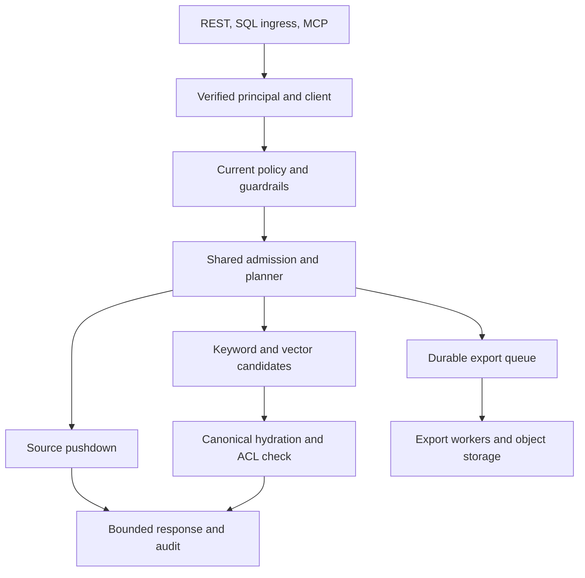

# SmartHub MCP & Agentic Gateway target architecture

This change adds a separate production composition root while preserving the existing Data Product, policy, cursor, RRF, promotion, MCP, and Control Hub contracts. The production runtime is `enterprise_data_platform.production_app:create_production_app`. Reference adapters remain available only in the explicitly selected reference application.

## Request path

The domain service owns authorization. SQL ingress translates a restricted SELECT into the same logical request; MCP delegates to that service. Neither receives source credentials. Aggregate queries have a separate `aggregate` capability. Counts additionally require `exact_count` at product, policy, client, OAuth, and agent levels when applicable.

## Planes and ownership

| Plane | Implementation | Authoritative state | Scaling boundary |
|---|---|---|---|
| Control | `durable.py`, `control_models.py`, control routes | PostgreSQL revisions, version history, audit | API replicas share an external HA PostgreSQL service |
| Structured data | `connectors.py`, `sqlalchemy_backend.py`, `aggregation.py` | Source database | Independent bounded pools per source and replica; global admission remains in SQL |
| Retrieval | `search.py`, `retrieval.py`, `chunks.py` | Canonical chunks plus committed record ledger | OpenSearch owns keyword/ANN sharding; PostgreSQL chunks have 32 dataset hash partitions |
| Indexing | `ingestion.py`, `jobs.py`, indexing worker | Durable jobs, source publication offsets, record versions, completion progress | Multiple workers claim with `SKIP LOCKED`; events for one record serialize |
| Export | `durable_exports.py`, export worker | Durable job plus encrypted object manifest | Separate worker Deployment; bounded pages and independent parts |
| Identity/telemetry | `identity.py`, `observability.py` | OIDC issuer; SQL audit | Gateway/mesh supplies mTLS where required; OTLP collector is external |

A registry cache cannot grant access. Each production operation reads current client, agent, policy, and guardrail state from SQL. Connection handles and bounded schema/embedding caches are disposable process-local optimizations. A control-store failure prevents authorization and admission; the runtime does not fall back to cached grants.

## Connector SPI

`Connector` exposes query, aggregation, schema, statistics, partitions, bulk reads, CDC, health, and close boundaries. `ConnectorCapabilities` describes which operations are supported. Factories isolate driver configuration from business logic.

| Binding | Concrete path | Validation / qualification |
|---|---|---|
| PostgreSQL | SQLAlchemy + psycopg, TLS verification, read-only transaction, statement timeout, parameterized EXPLAIN | Real PostgreSQL 16 CI covers query, estimates, scan rejection, durable state, concurrency and CDC atomicity |
| MySQL | SQLAlchemy + PyMySQL, CASE-based NULL ordering, read/write timeout, TLS verification, MAX_EXECUTION_TIME | Adapter code; managed-source integration pending |
| MariaDB | `mariadb+pymysql` dialect, max_statement_time and CASE NULL ordering | Adapter code; managed-source integration pending |
| Snowflake | Installed Snowflake SQLAlchemy dialect and session statement timeout | Factory integration; account/warehouse qualification pending |
| Denodo | Enterprise-installed Denodo SQLAlchemy dialect | Integration boundary; vendor driver, TLS, cancellation and timeout qualification pending |
| JDBC/ODBC/other SQL | An installed SQLAlchemy dialect or registered `Connector` factory | No universal driver semantics are claimed; each plugin must pass its contract tests |
| REST | HTTPS governed-page protocol, host allowlist, public-IP DNS pinning, bounded response | HTTP/DNS fault tests; real upstream protocol qualification pending |

Only PostgreSQL currently supplies plan estimates. Other SQL registrations are rejected by the scan gate unless `native_scan_governor=true` explicitly records that a source-native governor has been configured and tested. This setting does not create that governor. Query timeouts remain required. Planner estimates are advisory; they do not measure or guarantee the number of physical rows scanned.

## Governed planning

The engine name is configurable with `EDP_ENGINE_NAME`. Executable plans select source query/aggregate pushdown, keyword, vector, hybrid fusion, canonical hydration, and asynchronous export. Decisions include connector capabilities, request modality, bounded output, remaining deadline, workload admission, and required security stages. An explicitly enabled hybrid retrieval fallback can select keyword-only retrieval when less than one second remains. Backend circuit breakers reject unhealthy sources; optional keyword fallback handles vector/embedding unavailability.

The connector inspects the fully governed PostgreSQL statement after tenant/policy predicates are added. It rejects estimated scans over the registered budget. Large sequential scans cannot be justified solely by a small LIMIT. Tenant-filtered estimates use EXPLAIN without ANALYZE; unfiltered catalog statistics are not returned as tenant counts.

`Strategy` includes extension names for federation, parallel partition execution, materialization, cached results and precomputed products. **Those names are not executable implementations.** No general-purpose federated optimizer, distributed join engine, materialized-view manager, or result-cache execution path is included. Adding one requires the same authorization, cost, deadline, admission, and audit contract.

## Index consistency

An event identifies dataset/schema version, target index version, partition, event ID, comparable source sequence, record ID, source version, tenant, values and ACL. `publish_page` atomically commits a bounded event page and the connector's resume token. The connector must capture its source snapshot/CDC boundary and produce comparable per-record sequences; a wall-clock timestamp invented by the worker is not a substitute.

Workers hold one record lock and a fenced job lease while writing required sinks. Both keyword and vector acknowledgements must succeed before canonical chunks, record version, completion progress and job success commit. A partial failure rolls back the SQL transaction; externally written candidates are replayed. Retrieval verifies the committed canonical record and its ACL before exposing text. External bulk writes use source sequence versions and deterministic chunk IDs.

The worker completion checkpoint is the highest **processed** sequence. It is not a safe contiguous source-consumer offset when workers complete out of order. Only the transactional source publication checkpoint governs upstream resume/acknowledgement.

Promotion locks both index deployment rows and commits a single routing pointer. Each request uses one active/canary version for keyword, vector and hydration. Quality evidence must pass before traffic moves. Old versions remain available for rollback and require a separately controlled retention process.

## Bounds and failure behavior

| Resource | Default bound |
|---|---:|
| Global / background admitted operations | 200 / 40 |
| Tenant / client / principal / source concurrency | 40 / 20 / 10 / 20 |
| Background share of tenant/source concurrency | At most one quarter, with a minimum of one |
| API deadline / request body / response body | 30 s / 1 MB / 8 MB |
| Control / source pool per replica | 10 / 8; no overflow |
| Queued + running jobs per kind | 10,000 |
| Job lease / attempts | 60 s / 5 |
| Export page / part | Up to 1,000 rows / 50,000 rows or about 64 MB |
| Export quota | 10 million rows / 10 GB per job |
| Ingestion record / chunks | 200,000 characters / 1,000 chunks |
| Embedding batch / cache | 64 texts / 2,048 entries and 16 MB |
| Registry/policy/guardrail snapshot | 1,000 entries; policy/guardrail overflow fails closed |

Limits are configurable within the model's validation constraints. Memory is additionally bounded by pod limits and worker separation. The runtime does not yet implement per-tenant byte-per-second accounting or a source-independent physical scan counter. Source-native governors and infrastructure resource limits are part of the deployment contract.

## HA and capacity qualification

API replicas have no sticky-session requirement. Cursors are encrypted and scoped to principal, effective policy, product version, query and ordering. Jobs survive process restarts; expired leases can be claimed with new fencing tokens. Queue depth and admission are transactionally shared.

PostgreSQL, OpenSearch, object storage, identity and OTLP collection are external services. Multi-zone replication, backups, restore drills, database failover and certificate rotation belong to the deployed environment. The canonical SQL store and per-kind queue counter remain throughput boundaries: 32 PostgreSQL partitions do not prove distributed billion-chunk capacity. Very large installations must qualify or replace these SPI implementations with partitioned durable services before making scale claims.

See [PRODUCTION_READINESS_CHECKLIST.md](PRODUCTION_READINESS_CHECKLIST.md) and [PERFORMANCE_RESULTS.md](PERFORMANCE_RESULTS.md) for measured evidence and open gates.
