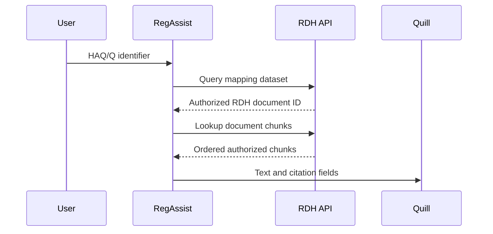

# RegAssist integration guide

**Audience:** RegAssist API and orchestration engineers

**Purpose:** resolve known identifiers, obtain document chunks and coordinate keyword/vector retrieval

**Shared rules:** [Common API contract](COMMON_API_CONTRACT.md)

RDH exposes governed data products. RegAssist sends only logical dataset and field names published by RDH; it does not connect to source PostgreSQL, Q or vector tables directly.

## Required handoff values

RDH provides these values per environment:

| Value | Example form |
|---|---|
| Base URL | `https://<rdh-api-host>` |
| OAuth audience and token endpoint | Issuer-managed values |
| Registered client ID | `regassist` |
| Dataset IDs | For example `rdh.rimdocs.clinical` |
| Granted scopes | `edp:query edp:keyword edp:vector` as needed |
| Verified identifier fields | For example `doc_id`; EDMS/HAQ fields only when registered |
| Dataset/filter contracts | Returned by discovery endpoints |
| Timeout/SLO and support route | Environment-specific |

The examples use synthetic IDs. Replace them with values returned by the live schema contract.

## Select the correct API

| User input | RegAssist action | API |
|---|---|---|
| Verified RDH document ID | Retrieve ordered chunks by ID | `POST /v1/datasets/{dataset}/records/lookup` |
| EDMS number | Use the EDMS field only if it appears in schema/filter discovery; then exact lookup/query | `records/lookup` or `query` |
| HAQ/Q identifier | Query the registered mapping dataset, then use the returned RDH document identifier | Two governed calls |
| Free text for Quill fusion | Call keyword and vector routes with the same filters and top-k, then pass both result lists to Quill | `search/keyword` and `search/vector` |
| RAG-ready context with RDH fusion | Request the configured mode through the retrieval route | `POST /v1/datasets/{dataset}/retrieve` |

The current source screenshots show `doc_id` but do not establish that it is an EDMS number. They also do not provide a Q/HAQ-to-EDMS mapping contract. RegAssist must not derive or concatenate those identities.

## Startup discovery

At startup, and whenever `dataset_version` changes:

1. Call `GET /v1/datasets` and verify the expected dataset is visible.
2. Call `GET /v1/datasets/{id}/capabilities`.
3. Call `GET /v1/datasets/{id}/schema` and resolve the published identity fields.
4. Call `GET /v1/datasets/{id}/filters?operation=query`.
5. For search, call `GET /v1/datasets/{id}/retrieval-contract` and the filter URL for each selected operation.

Fail closed if a required dataset, field, capability or vector profile is absent. Do not continue using a stale field mapping.

## Known document lookup

Request:

```bash
curl -fsS "$RDH_BASE_URL/v1/datasets/$DATASET_ID/records/lookup" \
  -H "Authorization: Bearer $RDH_ACCESS_TOKEN" \
  -H "Content-Type: application/json" \
  -H "X-Request-ID: regassist-lookup-001" \
  -H "X-Request-Timeout-Ms: 15000" \
  --data @examples/consumers/regassist/lookup-request.json
```

See [lookup-request.json](../../examples/consumers/regassist/lookup-request.json) and [lookup-response.json](../../examples/consumers/regassist/lookup-response.json).

The endpoint accepts 1–100 IDs. For native chunk datasets, omitting `id_field` defaults to the registered record-ID field, but RegAssist should send the discovered field explicitly. The response is a page of authorized chunks, not a document binary. Continue with `next_cursor` until it is null:

```json
{
  "id_field": "doc_id",
  "ids": ["DOC-EXAMPLE-001"],
  "select": ["chunk_id", "doc_id", "chunk_index", "chunk_text"],
  "order_by": [{"field": "chunk_index", "direction": "asc"}],
  "limit": 100,
  "cursor": "<opaque cursor from prior response>"
}
```

Keep the same IDs, projection, filter and order while paging. De-duplicate by `chunk_id` if an application retry repeats a successful page.

## Q/HAQ mapping flow

Use this flow only after RDH registers a mapping dataset with authoritative HAQ/Q and RDH document-ID fields.



The first request follows [q-mapping-query-request.json](../../examples/consumers/regassist/q-mapping-query-request.json); its illustrative output is [q-mapping-query-response.json](../../examples/consumers/regassist/q-mapping-query-response.json). Replace `haq_id` and `rdh_doc_id` with the names published by the actual mapping dataset.

Handle mapping results explicitly:

- Zero rows: return “no authorized mapping found”; do not run broad document search automatically.
- One row: use its registered RDH document identifier in the chunk lookup.
- Multiple rows: follow the business-approved selection rule or return an ambiguity; do not choose the first row silently.
- A mapping row never grants document access. The second lookup independently enforces document policy.

Cross-source joins are not part of the v1 consumer API, so RegAssist performs the two calls.

## Free-text 3A and 3B flow

For downstream Quill fusion, send the same query intent, filter constraints and `top_k` to both routes. Call them concurrently within the overall request deadline.

- 3A keyword: [keyword request](../../examples/consumers/rag-quill/keyword-request.json)
- 3B vector from query text: [vector query-text request](../../examples/consumers/rag-quill/vector-query-text-request.json)
- 3B vector supplied by the caller: [direct-vector request](../../examples/consumers/rag-quill/vector-direct-request.json)

Use the retrieval contract to decide whether `query_text` is supported. If RegAssist supplies a vector, its length and `vector_profile` must exactly match the active contract. Never silently pad, truncate or reuse a vector from another profile.

Forward to Quill:

- `record_id` and `chunk_id` as the stable fusion key.
- `ranks.keyword` and `scores.keyword` from 3A.
- `ranks.vector` and `scores.vector` from 3B.
- Authorized `text`, `metadata` and `source.citations`.
- `dataset_version`, `index_version`, `score_kind` and `trace_id` for provenance.

Keyword and vector raw scores are route-specific and are not directly comparable. Quill should fuse ranks or use a separately validated model.

## Response handling

A successful empty result is HTTP 200 with `results: []` or `rows: []`. Do not treat it as an infrastructure failure or reveal whether access policy removed matches.

RegAssist should:

- Preserve selected citation fields from exact lookup, or `source.citations` from search/retrieval, with every generated answer.
- Keep `trace_id` in internal diagnostics.
- Avoid placing document text, queries or filters in ordinary logs.
- Reject a response whose dataset/profile version is outside the application's tested compatibility range.
- Use bounded retries only for 429, 503 and 504 as defined in the common contract.
- Never fall back from vector to keyword unless product behavior and the user experience explicitly allow it.

## Consumer acceptance checks

Before enabling traffic, verify:

- Token, client registration, scopes and tenant claims produce the intended dataset list.
- Unauthorized tenant, group and document IDs return no data.
- One known document returns chunks in deterministic order across cursor pages.
- One missing ID returns an empty result.
- Q/HAQ zero, one and multiple mapping cases behave as approved.
- Keyword and vector calls use identical business filters.
- Quill preserves citations and uses ranks rather than comparing raw cross-mode scores.
- 400/401/403/429/503/504 behaviors and trace correlation are exercised.
